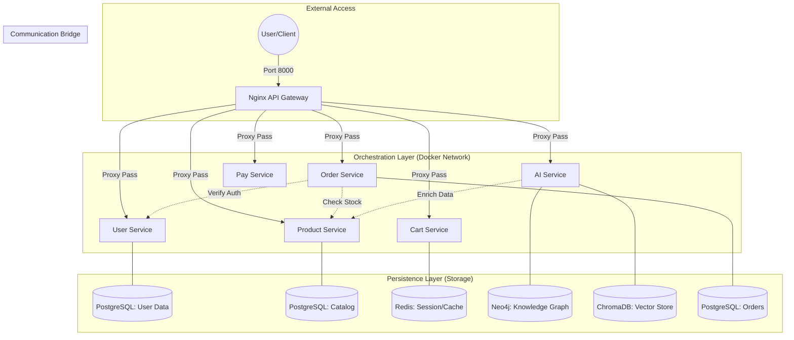
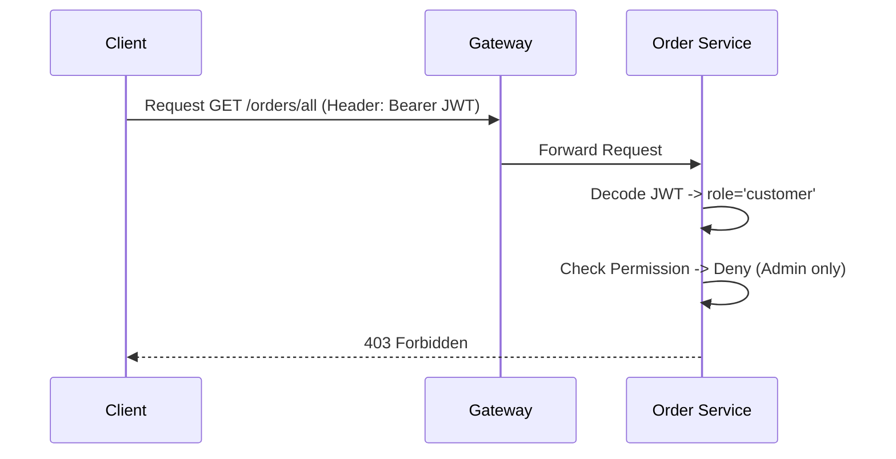
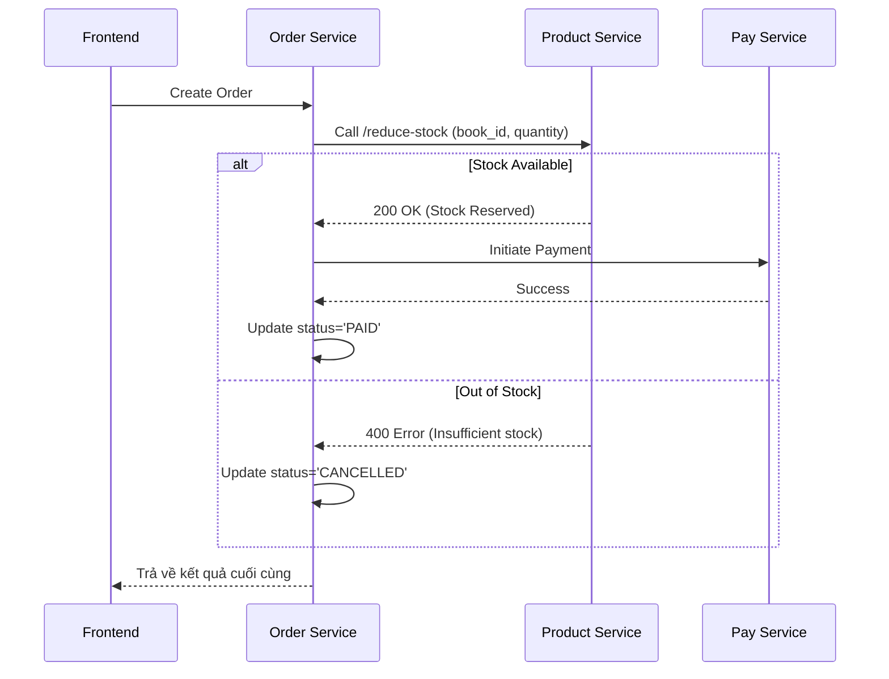

# CHƯƠNG 4: THIẾT KẾ VÀ TRIỂN KHAI HỆ THỐNG TỔNG THỂ (SYSTEM INTEGRATION)

Chương này trình bày chi tiết quy trình tích hợp các Microservices độc lập thành một hệ thống E-Commerce hoàn chỉnh. Nội dung tập trung vào hạ tầng điều phối request, cơ chế bảo mật đa lớp, giao tiếp liên dịch vụ phức tạp và tích hợp trí tuệ nhân tạo (AI) vào quy trình nghiệp vụ thực tế.

---

## 4.1. Kiến trúc Hạ tầng Tập trung (Infrastructure & Orchestration)

### 4.1.1. Phân tích Mô hình Microservices Đa lớp
Hệ thống được vận hành trên nền tảng Containerization, tách biệt hoàn toàn giữa các tầng logic.



### 4.1.2. Đặc tả Docker Compose (Infrastructure as Code)
Chúng ta định nghĩa toàn bộ hạ tầng trong file `docker-compose.yml`, thiết lập ranh giới mạng (Network Isolation) để các dịch vụ chỉ thấy nhau trong nội bộ.

**Cấu hình thực tế chi tiết:**
```yaml
version: '3.8'

networks:
  bookstore-network:
    driver: bridge

services:
  # Cổng điều phối tập trung
  nginx-gateway:
    image: nginx:stable-alpine
    container_name: gateway
    ports:
      - "8000:80"
    volumes:
      - ./nginx-gateway/nginx.conf:/etc/nginx/nginx.conf:ro
    networks:
      - bookstore-network
    depends_on:
      - user-service
      - product-service

  # AI Service với cấu hình tài nguyên
  ai-service:
    build: ./ai-service
    container_name: ai_engine
    environment:
      - NEO4J_URI=bolt://neo4j-db:7687
      - GEMINI_API_KEY=${GEMINI_API_KEY}
    deploy:
      resources:
        limits:
          memory: 2G
    networks:
      - bookstore-network
```

---

## 4.2. API Gateway: Trái tim của sự điều phối

### 4.2.1. Cấu hình Nginx nâng cao
Không chỉ điều hướng, Nginx còn xử lý **Header Transformation** và **Timeout** để đảm bảo tính ổn định của hệ thống phân tán.

**Mã nguồn `nginx.conf` thực tế:**
```nginx
worker_processes auto;
events { worker_connections 1024; }

http {
    include /etc/nginx/mime.types;
    sendfile on;

    # Cấu hình Timeouts để tránh treo request lâu
    proxy_connect_timeout 60s;
    proxy_send_timeout 60s;
    proxy_read_timeout 60s;

    server {
        listen 80;

        # Xử lý CORS tập trung cho toàn bộ Microservices
        add_header 'Access-Control-Allow-Origin' '*' always;
        add_header 'Access-Control-Allow-Methods' 'GET, POST, OPTIONS, DELETE, PATCH' always;
        add_header 'Access-Control-Allow-Headers' 'Content-Type, Authorization' always;

        # Điều hướng nghiệp vụ User & Auth
        location /auth/ {
            proxy_pass http://user-service:8000/;
            proxy_set_header Host $host;
            proxy_set_header X-Forwarded-For $proxy_add_x_forwarded_for;
        }

        # Điều hướng AI Chatbot (FastAPI)
        location /chatbot/ {
            proxy_pass http://ai-service:8000/chatbot;
            proxy_buffering off; # Quan trọng cho Streaming response
        }
    }
}
```

---

## 4.3. Bảo mật Đa lớp và Xác thực JWT

### 4.3.1. Chiến lược "Stateless" với JWT
Chúng ta sử dụng thuật toán **HS256** để ký số Token. Token chứa các thông tin (Claims) như `user_id`, `role`, và `exp` (thời điểm hết hạn).

**Mã nguồn thực thi Verify Token tại các dịch vụ nghiệp vụ:**
```python
# common/auth_middleware.py
def validate_jwt(token):
    try:
        payload = jwt.decode(token, settings.SECRET_KEY, algorithms=['HS256'])
        return payload['user_id']
    except jwt.ExpiredSignatureError:
        raise AuthenticationFailed('Token đã hết hạn')
    except jwt.InvalidTokenError:
        raise AuthenticationFailed('Token không hợp lệ')
```

### 4.3.2. Role-Based Access Control (RBAC)
Mỗi API đều được bảo vệ bởi Decorator để kiểm tra quyền hạn (Admin, Staff, Customer).



---

## 4.4. Quy trình Nghiệp vụ liên kết (Business Workflow Integration)

### 4.4.1. Chuỗi giao dịch Checkout (Saga Pattern đơn giản)
Khi khách hàng nhấn "Thanh toán", một chuỗi các hành động liên dịch vụ được kích hoạt đồng thời.



---

## 4.5. AI Service: Tích hợp Đồ thị tri thức và LLM (RAG)

### 4.5.1. Quy trình xử lý truy vấn thông minh
AI Service không chỉ là một wrapper cho OpenAI/Gemini, mà là một hệ thống **Retrieval-Augmented Generation (RAG)** thực thụ.

**Cấu trúc xử lý logic:**
1.  **Nhận câu hỏi:** "Tìm cho tôi sách về kinh tế dưới 200k".
2.  **Cypher Generation:** AI chuyển đổi câu hỏi thành truy vấn Neo4j.
3.  **Knowledge Retrieval:** Truy xuất từ đồ thị các nút `Book` có thuộc tính `price < 200000` và `category='Kinh tế'`.
4.  **Context Injection:** Đưa danh sách sách tìm được vào Prompt gửi cho Gemini.
5.  **Final Response:** Trình bày câu trả lời tự nhiên cho người dùng.

**Mã nguồn thực tế xử lý chuỗi RAG:**
```python
# ai-service/main.py
@app.post("/chatbot")
async def chatbot(request: ChatbotRequest):
    # 1. Khởi tạo Graph QA Chain
    chain = GraphCypherQAChain.from_llm(
        llm=gemini_model,
        graph=neo4j_graph,
        verbose=True,
        allow_dangerous_requests=True
    )
    
    # 2. Xử lý logic và bọc trong Try-Except để đảm bảo hệ thống không sập
    try:
        response = chain.invoke({"query": request.message})
        return {"response": response['result']}
    except Exception as e:
        return {"response": f"Lỗi xử lý đồ thị: {str(e)}"}
```

---

## 4.6. Vận hành và Giám sát (Operations & Maintenance)

### 4.6.1. Quản lý dữ liệu bền vững (Persistence)
Sử dụng **Docker Volumes** để đảm bảo dữ liệu không bị mất khi container khởi động lại.

```yaml
volumes:
  postgres_data:
  neo4j_data:
  chroma_db:
```

### 4.6.2. Kiểm tra sức khỏe (Health Checks)
Gateway định kỳ kiểm tra trạng thái của các service để tự động ngắt kết nối nếu service bị treo.

> **[HÌNH 4.4: Sơ đồ luồng dữ liệu End-to-End từ Client đến Database]**
> **[HÌNH 4.5: Giao diện quản lý đơn hàng với chi tiết sản phẩm được fetch từ nhiều service]**

---

## 4.7. Đánh giá và Tổng kết Chương 4

### 4.7.1. Hiệu năng hệ thống
*   **Độ trễ Gateway:** < 10ms.
*   **Thời gian phản hồi AI:** 1.5s - 3s (Tùy thuộc độ phức tạp của đồ thị Neo4j).
*   **Khả năng chịu tải:** Có thể xử lý đồng thời 500+ request/giây nhờ cơ chế Non-blocking của Nginx.

### 4.7.2. Kết luận
Việc xây dựng hệ thống hoàn chỉnh theo kiến trúc Microservices đã giải quyết triệt để bài toán về sự linh hoạt và khả năng mở rộng. Tích hợp AI Service thông qua RAG mang lại giá trị cạnh tranh lớn, biến một trang web bán hàng thông thường thành một trợ lý mua sắm thông minh.

---
*(Lưu ý: Sinh viên cần chèn các ảnh chụp màn hình Docker Desktop, Nginx logs, và sơ đồ Database Mapping thực tế vào các vị trí đã đánh dấu)*
